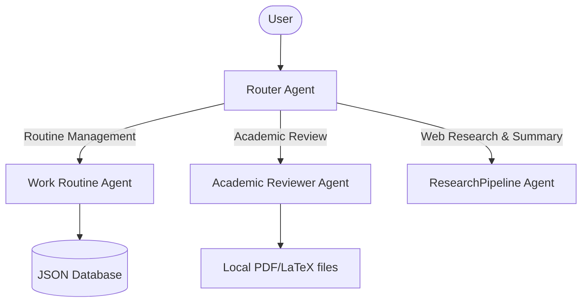

# Multi-Agent Routine, Reviewer & Research Assistant


PPGEEC2327 - TÓPICOS ESPECIAIS EM PROCESSAMENTO INTELIGENTE DA INFORMAÇÃO - T01 (2026.1 - 5T3456)

Docente: Prof. Dr Ivanovich Medeiros Dantas Silva

Discentes:   
- Angelo Leite Medeiros de Góes (20251012333)
- William Marcelino Costa do Nascimento (20251026230)

Link do vídeo: https://drive.google.com/file/d/11izD6TU2eRrJTTEc6qDhziOLLqjPjCOV/view?usp=sharing

Este trabalho investiga a criação de agentes com a plataforma ADK do Google para auxiliar na criação e desenvolvimento de trabalhos acadêmicos.

Foi desenvolvido um sistema de agentes para organizar rotina de trabalho, revisar textos acadêmicos e pesquisar literatura científica.

O sistema possui uma estrutura multiagente hierárquica coordenada por um agente de roteamento (`router_agent`), que delega as solicitações para três especialistas apropriados:



## Funcionalidades dos Especialistas

1. **Work Routine Agent**:
   - Salva, lista e remove tarefas e eventos com persistência local em JSON (`app/database.json`).
   - Resolve datas relativas (ex: "hoje", "amanhã") consultando o relógio do sistema.
   - Exige confirmação por texto do usuário antes de excluir qualquer item.

2. **Academic Reviewer Agent**:
   - Analisa gramática, ortografia e estilo de textos diretamente no prompt ou a partir de caminhos de arquivos locais `.pdf` e `.tex`.
   - Formata os problemas encontrados com quebras de linha detalhando o trecho original (com erro em **negrito**), explicação e sugestão de correção.
   - Responde em inglês por padrão ou em português se o texto analisado estiver em português.

3. **Research Pipeline Agent**:
   - Agente sequencial que automatiza a busca em múltiplos provedores científicos (arXiv, OpenAlex, CrossRef).
   - Classifica e ordena os resultados por relevância técnica.
   - Gera relatórios estruturados contendo Visão Geral (Overview), Temas de Pesquisa, Principais Artigos, Ordem de Leitura Sugerida e Direções Futuras de Pesquisa.

---

## Pré-requisitos e Instalação

### 1. Requisitos
- **Python >= 3.11**
- **uv** (gerenciador de pacotes rápido) e **google-agents-cli**:
  ```bash
  curl -LsSf https://astral.sh/uv/install.sh | sh
  uv tool install google-agents-cli
  ```

### 2. Configuração Local
Adicione a chave do Gemini no arquivo `.env` na raiz do projeto:
```env
GEMINI_API_KEY=SUA_CHAVE_DE_API
```
Instale todas as dependências do ambiente virtual:
```bash
uv sync
```

---

## Como Executar e Interagir

### Playground (Web UI)
Inicie a interface web interativa para conversar com o agente no navegador:
```bash
agents-cli playground
```

### CLI (Terminal)
Você pode testar a delegação automática enviando mensagens direto pelo terminal:

- **Gerenciar Rotina de Trabalho:**
  ```bash
  agents-cli run "Quais são as minhas tarefas?"
  agents-cli run "Salvar tarefa 'Escrever Relatório' para amanhã"
  agents-cli run "Remover a tarefa 'Escrever Relatório'"
  ```

- **Revisão Acadêmica:**
  ```bash
  agents-cli run "Revisar o arquivo test_academic.tex"
  agents-cli run "Review the text: 'We was going to the store'"
  ```

- **Pesquisa Acadêmica (Web Research):**
  ```bash
  agents-cli run "Pesquise sobre inteligência artificial aplicada à medicina"
  ```

---

## Estrutura do Projeto

```
learn-adk/
├── app/
│   ├── agent.py         # Definições do Router, Routine e Reviewer agents
│   ├── database.json    # Banco de dados local em formato JSON
│   ├── academic_reviewer/  # Agente Revisor isolado (agent, tools, __init__)
│   ├── work_routine_agent/ # Agente de Rotina isolado (agent, tools, __init__)
│   └── research_agent/  # Módulos e subagentes do pipeline de pesquisa (search, ranking, summarizer)
├── pyproject.toml       # Dependências do projeto (google-adk, pypdf, arxiv, etc.)
└── README.md            # Este arquivo
```
